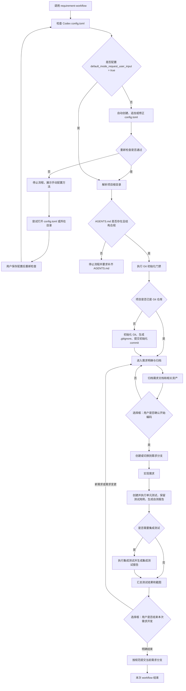

# AGENTS.md

## 项目名称

Requirement Workflow Skill

## 项目说明

本项目是一个 Codex skill，用于启动和执行需求开发工作流。它要求先完成 Codex 配置检查与自动修复、项目说明与 Git 基线检查，再进行需求澄清、需求归档、分支开发、单元测试用例保留、测试报告、选择框确认、收尾确认和最终提交。

## 技术栈

- Codex Skills
- Markdown
- Mermaid
- TOML
- request_user_input
- Git

## 目录结构

```text
.
|-- SKILL.md
|-- AGENTS.md
|-- agents/
|   `-- openai.yaml
`-- assets/
    |-- AGENTS.md
    |-- REQUIREMENT.md
    `-- TEST_REPORT.md
```

## 开发规范

### Requirement Workflow 流程

1. 检查并在需要时自动配置 Codex `config.toml`。
2. 确认 `config.toml` 中存在以下配置：

```toml
[features]
default_mode_request_user_input = true
```

3. 如果 `config.toml` 缺失或配置不正确，先自动尝试创建、追加或修正配置。
4. 自动修复后重新检查；检查通过才继续。
5. 如果用户拒绝写入授权、写入失败或修复后仍不通过，停止流程，展示手动配置方法，并尝试打开 `config.toml`；如果文件不存在且无法创建，则尝试打开所在目录。
6. 用户保存配置后，重新检查 Config 门禁。
7. Config 门禁通过后，解析项目根目录。
8. 检查项目根目录下的 `AGENTS.md`，缺失或结构不合规时停止流程。
9. `AGENTS.md` 通过后，立即执行 Git 初始化门禁。
10. Git 门禁通过后，进入需求明确与归档。
11. 需求归档后，使用选择框询问用户是否开始编码。
12. 用户通过选择框确认编码后，从主干分支创建或切换到需求分支。
13. 在需求分支上实现需求。
14. 创建或更新自动化单元测试用例，执行单元测试，完成其他必要自测，生成自测报告和必要截图。
15. 如涉及跨组件、接口、数据库、外部服务或部署行为，执行集成测试并生成集成测试报告。
16. 测试通过后，使用选择框询问用户是否结束本次需求开发。
17. 如果用户提出新需求或需求变更，回到“需求明确与归档”步骤，重新走后续流程。
18. 如果用户通过选择框明确结束本次开发，在当前需求分支提交需求归档、实现代码、单元测试用例、测试报告和相关测试资产。
19. 提交成功后，本次 workflow 结束。若要再次使用，必须重新调用 `$requirement-workflow`。

### 流程图



### 提交规范

提交信息优先遵循项目内已有规范或历史提交风格。没有明确规范时，使用简洁的 Conventional Commit。`<summary>` 必须使用中文，提交类型前缀保留英文：

```text
feat: <需求摘要>
fix: <需求摘要>
docs: <文档变更摘要>
chore: <工程事务摘要>
```

### 单元测试规范

- 每次实现代码变更都必须新增或更新自动化单元测试。
- 单元测试用例必须保留在项目常规测试目录或约定的测试资产目录中，作为版本化文件提交。
- 不允许用手工验证、lint、build、截图或集成测试替代单元测试。
- 如果项目没有单元测试框架，应补充最小可用的项目适配测试配置和测试用例。
- 如果需求确实无法形成有意义的单元测试，必须在收尾前停止并让用户确认如何调整需求或测试范围，不得直接结束并提交。

### 用户确认规范

工作流中所有需要用户确认或在已知路径中做选择的节点，都必须使用 `request_user_input` 弹出选择框，不允许只用普通聊天消息询问。

必须使用选择框的节点包括：

1. 需求归档后，确认是否开始编码。
2. 需求变更归档后，确认是否再次开始编码。
3. 测试通过后，确认是否结束本次需求开发。
4. 存在多个明确候选主干分支时，让用户选择主干分支。
5. 需求相关改动和用户无关改动无法安全拆分时，让用户选择处理方式。

选择框规则：

- 每次提供 2 到 3 个互斥选项。
- 推荐选项放在第一位。
- 用户未选择前，不进入下一步。
- 如果选择框能力不可用，停止流程并提示需要先启用选择框用户输入能力。

### Config 自动配置规范

`config.toml` 是 Codex 全局配置，不属于当前项目文件。Config 门禁处理该文件时遵循以下规则：

- 如果 `config.toml` 不存在，自动创建并写入 `[features]` 配置。
- 如果已有 `[features]`，只在该表内新增或更新 `default_mode_request_user_input = true`。
- 如果没有 `[features]`，在文件末尾追加该表和配置项。
- 保留其他已有配置，不重写无关内容。
- 如果写入需要授权，先请求授权；用户拒绝或写入失败时，展示手动配置方法并尝试打开文件或目录。
- 不把 `config.toml` 纳入项目 Git 状态检查、暂存、提交、需求归档或测试资产。

### 工作流边界

- Config 门禁未自动配置并验证通过前，不解析项目、不检查项目文件、不做需求分析。
- 未通过 `AGENTS.md` 门禁前，不做需求分析、代码检查或实现。
- 未完成需求归档前，不开始编码。
- 用户未通过选择框确认开始编码前，不写实现代码。
- 未创建或更新单元测试用例、未执行单元测试并保留测试用例文件前，不进入结束开发确认。
- 用户未通过选择框确认结束本次需求开发前，不创建 closeout commit。
- 本次 workflow 结束后，不自动重启；再次使用需要重新调用 `$requirement-workflow`。
